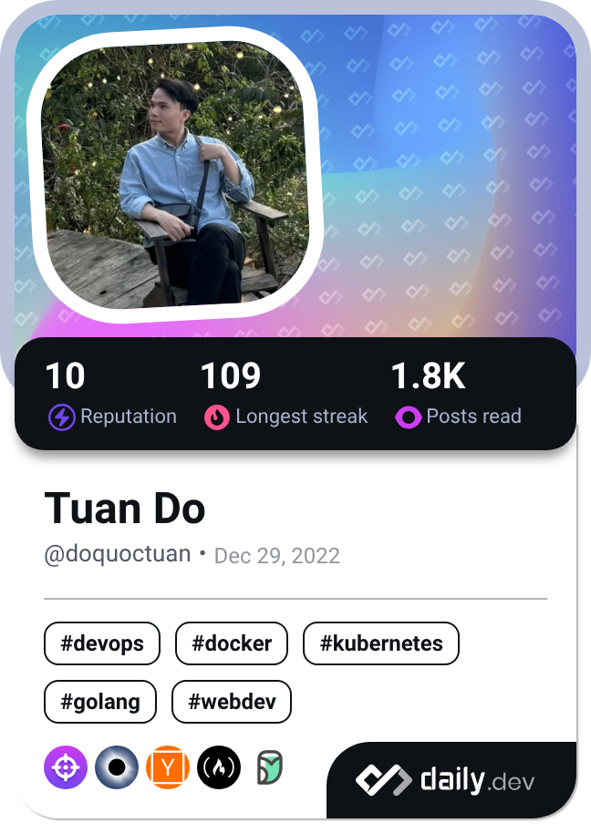

### Hello Quoc Tuan Do, I'm a backend developer and use C# on most of my projects.

**Languages and tools:**

  
  
  
  
  
  
  
  
  

  |   
:-------------------------:|:-------------------------:

